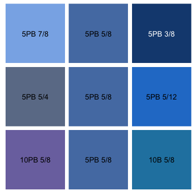
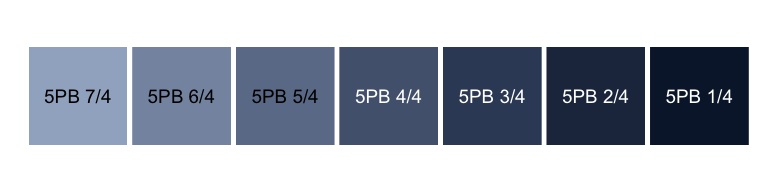
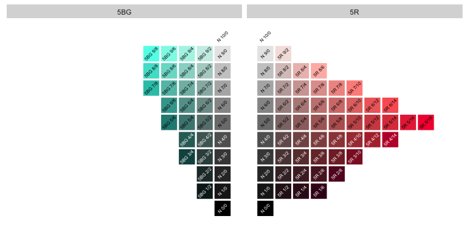

<!-- README.md is generated from README.Rmd. Please edit that file -->


munsell
=======

The `munsell` package provides easy access to, and manipulation of, the Munsell colours. The `munsell` package provides a mapping between Munsell's orginal notation (e.g. "5R 5/10") and hexidecimal sRGB strings suitable for use directly in R graphics. The package also provides utilities to explore slices through the Munsell colour tree, to transform Munsell colours and display colour palettes.

Munsell devised his system of colour notation to match the three percetual dimensions of colour: hue, value and chroma. His notation provides a naming scheme to colours that eases the choice of color according to a specific purpose. His century old advice is still relevent for the producers of statistical graphics and the munsell package aims to enable user to easily follow it.

Functions in `munsell` fall into three basic use categories: specifying Munsell colours, altering Munsell colours and exploring the Munsell color space.

The code below relies on the development version of `munsell`, get it with:

``` r
devtools::install_github("cwickham/munsell")
```

Color specification
-------------------

Following Munsell, specifying colours is done with a specific string format: "H V/C" where H is a hue code (see `mnsl_hues()` for a list of those available, excluding "N"), V an integer in \([0, 10]\) specifying value, and C an even integer specifying chroma. The `mnsl` function takes the string and returns a hexadecimal RGB representation:

``` r
library(munsell)
mnsl("5R 5/10")
#> [1] "#C65858"
```

Visually examining a colour can either be done by using `mnsl` with a base plotting call, or using `plot_mnsl` which plots colour swatches using `ggplot2`:

``` r
plot.new()
rect(0, 0, 1 ,1 , col = mnsl("5R 5/10"))
plot_mnsl("5R 5/10")
```

Colour manipulation
-------------------

`munsell` provides convenience functions that alter a colour by taking steps in the hue, value and chroma dimensions: `rygbp`, `pbgyr`, `lighter`, `darker`, `saturate` and `desaturate`.

``` r
my_blue <- "5PB 5/8"
p <- plot_mnsl(c(
  lighter(my_blue, 2),      my_blue,   darker(my_blue, 2),
  desaturate(my_blue, 2),   my_blue,   saturate(my_blue, 2),
  rygbp(my_blue, 2),        my_blue,   pbgyr(my_blue, 2)))
p
```



Each function optionally takes the number of steps to take in the dimension and consequently are easily used to create scales in a particular dimension.

``` r
p <- plot_mnsl(sapply(0:6, darker, col = "5PB 7/4"))
p + ggplot2::facet_wrap(~ num, nrow = 1)
```



Colour space exploration
------------------------

Slices through the colour space of constant hue, chroma or value can be displayed using the functions: `hue_slice`, `chroma_slice` and `value_slice`. Additionally `complement_slice` displays a slice of constant hue, alongside a slice of its complement, the hue that is on the opposite side of the colour sphere to that specified.

``` r
complement_slice("5R")
```


